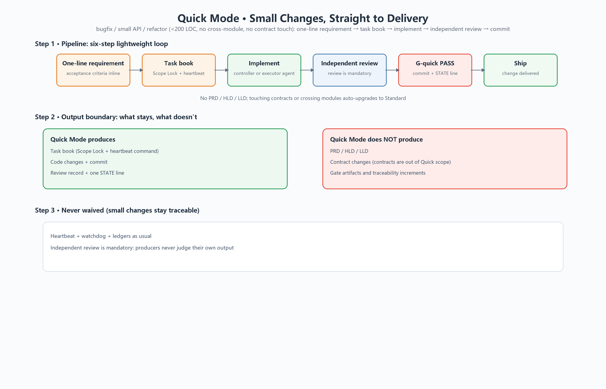
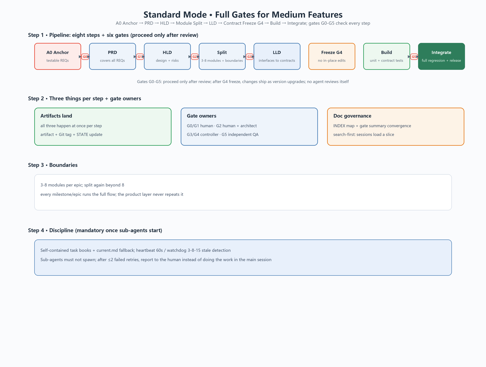
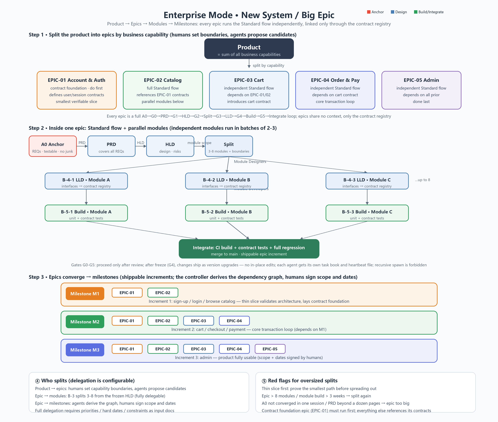

# Vibecoding Orchestration

> [中文](README.md) · formerly standard-devflow

A multi-agent orchestration framework that turns "vibe coding" into a **deliverable pipeline**: three modes for small changes, medium features, and large projects — all sharing the same gate and contract discipline.

**Keywords**: vibecoding · AI agent workflow · multi-agent orchestration · PRD/HLD/LLD · contract freeze · gates G0-G5 · sub-agent orchestration · Codex skill · opencode

## What It Is

Not a "large-project-only" process. It covers the whole spectrum, from a one-line bugfix to an entire product:

- **Small changes stay light**: bugfixes, small APIs, and refactors use Quick Mode — one-line requirement + task book + implementation + independent review, then ship.
- **Medium features get full protection**: requirement anchor → PRD → HLD → module split → LLD → contract freeze → build → integration, gated by G0-G5.
- **Large projects stay parallel and replayable**: epic/milestone splitting, 2-3 parallel module agents, a contract registry linking epics, independent heartbeats, and ledger-based review.

The flow **auto-escalates or auto-degrades** as the change grows or shrinks — you never switch to a different system.

## Problems It Solves

| Pain point | How this flow handles it |
|---|---|
| Sessions forget | Files are the source of truth: every artifact lands on disk; handoff is "path + one-page summary" |
| Context explosion | INDEX document map + gate summaries + search-first; a session only loads what it needs |
| Self-review | Producers never judge their own output: G2/G5 require an independent review agent |
| Parallel conflicts | Scope Lock in task books + contract freeze + per-agent heartbeat files |
| Heavyweight for small fixes | Quick Mode skips PRD/HLD/LLD but never skips review |
| Platform chaos | Core vs adaptation layers: Codex native, opencode sample adapter, community templates for the rest |
| Black-box execution | Three ledgers (orchestration/runs/facts), watchdog stale detection, analyze-flow replay |

## Three Modes







| Mode | When | Pipeline |
|---|---|---|
| Quick | bugfix / small API / refactor (<200 LOC, no contract touch, no cross-module) | one-line requirement → task book → implement → independent review → G-quick PASS → commit |
| Standard | medium features (most development) | A0 anchor → G0 → PRD → G1 → HLD → G2 → module split → G3 → LLD → G4 freeze → build → G5 → integrate |
| Enterprise | new system / big epic (long-term iteration) | full Standard flow + epic/milestone splitting + 2-3 parallel modules + contract registry + Git branches/tags |

**Auto escalation**: Quick → Standard when contracts, cross-module changes, or architecture are touched; Standard → Enterprise when an epic exceeds 8 modules or needs parallelism and milestones; Enterprise → Quick for a one-off small change.

## Core Design

1. **Distill requirements first**: noisy discussion converges at the requirement anchor; downstream only sees the anchor.
2. **Supervisors serial, executors parallel**: PRD → HLD → split → LLD → build is strictly sequential; only module designers/developers run in parallel.
3. **Gates never idle**: every gate G0-G5 has an owner and checklist; producers never review their own output.
4. **Contract freeze**: after G4, no in-place edits; changes ship as version upgrades; modules/epics connect only through the contract registry.
5. **Mandatory sub-agent orchestration (file-based protocol)**: LLD/build/G2/G5 must spawn sub-agents; self-contained task books with current.md fallback; heartbeat/watchdog/lock/ledgers make execution observable, recoverable, and replayable; recursive spawning is forbidden.
6. **Core vs adaptation layers**: stages, gates, roles, and red lines are frozen; environment/platform compensation lives in `references/environment-adaptation.md` and can be removed as a whole when platforms improve.
7. **Cross-platform scripts**: `scripts/node/` is a full Node port (macOS/Linux/Windows); Windows Codex may keep using the PowerShell versions; CI smoke-tests all three OSes.
8. **Zero-copy install**: one Codex skill, usable by every project; other platforms use `adapters/`.

## Install (Codex)

### Option A: manual copy (Windows)

```powershell
Copy-Item -LiteralPath '.\vibecoding-orchestration' -Destination "$env:CODEX_HOME\skills\vibecoding-orchestration" -Recurse -Force
```

> Note: if the destination already exists, `Copy-Item` nests the source (`vibecoding-orchestration\vibecoding-orchestration\`). Remove the inner duplicate or copy item-by-item:

```powershell
$src = '.\vibecoding-orchestration'
$dst = "$env:CODEX_HOME\skills\vibecoding-orchestration"
Get-ChildItem -LiteralPath $src | ForEach-Object { Copy-Item -LiteralPath $_.FullName -Destination $dst -Recurse -Force }
```

### Option B: skill-installer

```powershell
python "$env:CODEX_HOME\skills\.system\skill-installer\scripts\install-skill-from-github.py" https://github.com/qi-mouren/vibecoding-orchestration --path skills/vibecoding-orchestration
```

### Validate

```powershell
$env:PYTHONUTF8 = '1'
python "$env:CODEX_HOME\skills\.system\skill-creator\scripts\quick_validate.py" "$env:CODEX_HOME\skills\vibecoding-orchestration"
```

### Global rules

Put the content of [docs/global-agents.md.example](docs/global-agents.md.example) into `$env:CODEX_HOME\AGENTS.md` so every session loads it.

## Usage

1. A new project only needs a 3-line `AGENTS.md`: product name, current epic, STATE pointer (`docs/process/STATE.md`).
2. Say "use vibecoding-orchestration for this epic"; for small changes just describe the requirement and Quick Mode kicks in.
3. At the start of every session, read `docs/process/STATE.md` and run the health check (Windows: `scripts/check-flow.ps1`; macOS/Linux: `scripts/node/check-flow.mjs`).

## Multi-Platform Adaptation

The core flow is platform-agnostic; only "sub-agent orchestration capabilities" differ. This repo provides:

- [Adapter contract & acceptance checklist](adapters/README.md): six capabilities (spawn / message / interrupt / list / shell / heartbeat) + community contribution flow.
- [opencode sample adapter](adapters/opencode/README.md): role cards, heartbeat script, config example.
- [zcode adapter](adapters/zcode/README.md): ZCode install steps, role cards, heartbeat plan (community contribution, live acceptance passed).
- [Blank template](adapters/_template/README.md): starting point for Claude / any other platform.

## Repository Layout

```
adapters/                      # multi-platform adapters: contract + opencode sample + template
vibecoding-orchestration/      # skill source (core flow + adaptation layer)
├── SKILL.md                   # skill entry: triggers + overview + red lines
├── agents/openai.yaml         # UI metadata
├── references/                # workflow / roles / gates / splitting / doc governance / env adaptation
├── assets/templates/          # artifact templates (PRD/HLD/LLD/task book/STATE…)
└── scripts/
    ├── *.ps1                  # Windows Codex scripts (PowerShell)
    └── node/                  # cross-platform Node port (macOS/Linux/Windows)
tools/draw-flow-panorama.py    # mode panorama generator (three modes × zh/en)
docs/global-agents.md.example  # global AGENTS.md example
flow-quick-zh.png / flow-quick-en.png           # Quick Mode diagrams (zh/en)
flow-standard-zh.png / flow-standard-en.png     # Standard Mode diagrams (zh/en)
flow-enterprise-zh.png / flow-enterprise-en.png # Enterprise Mode diagrams (zh/en)
```

## License

[MIT](LICENSE)
