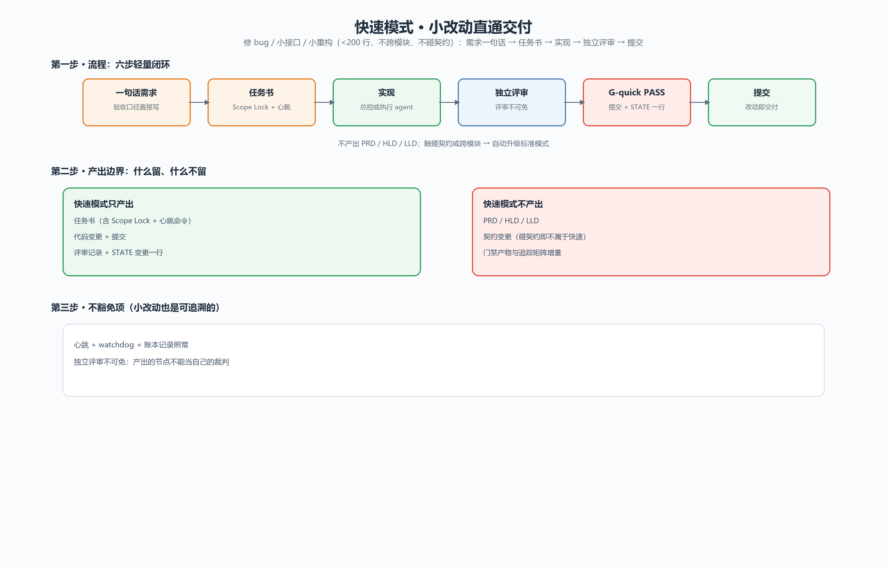
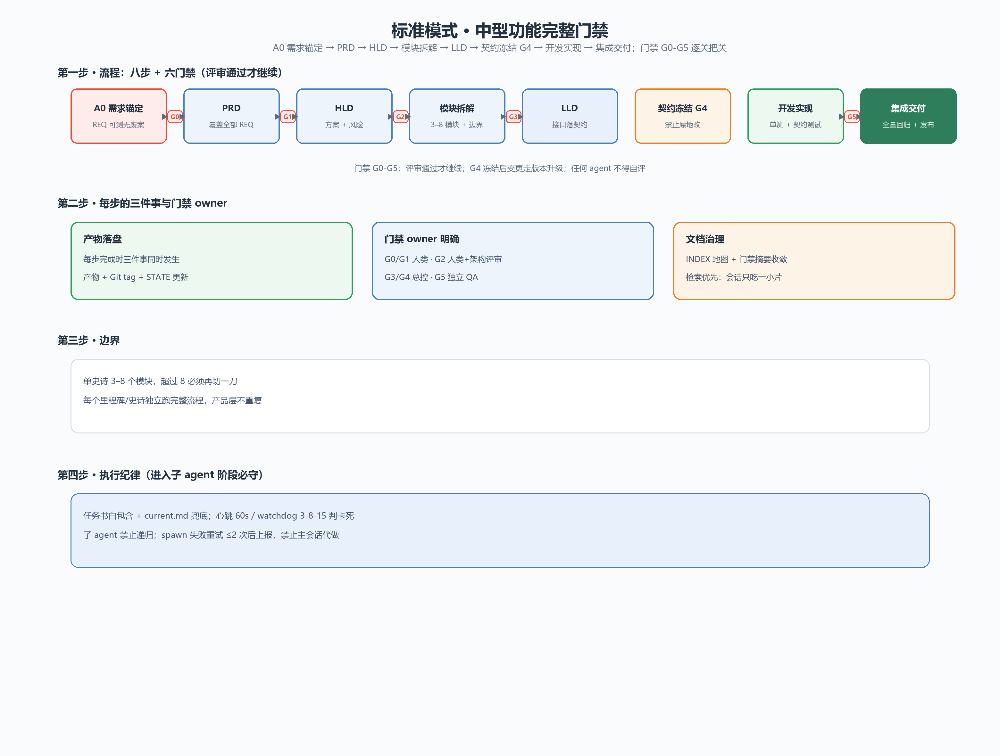
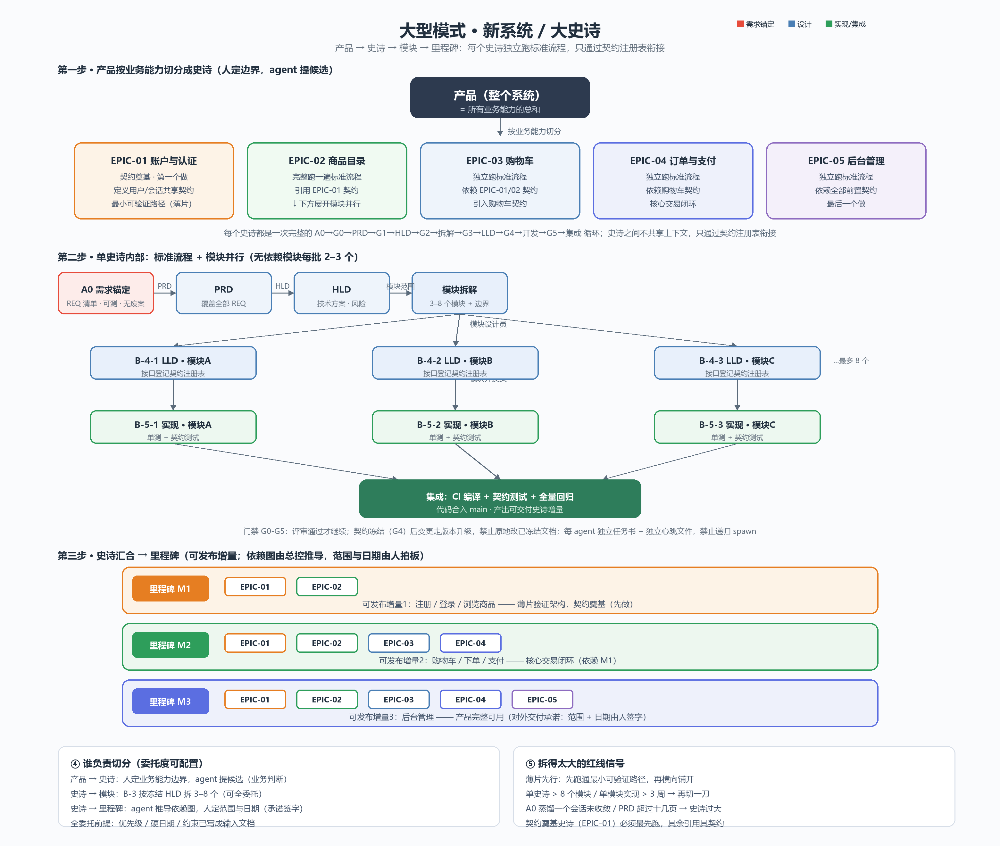

🌐 **Language:** [English](README.en.md) · [中文](README.md)

# Vibecoding Orchestration（vibe coding 全流程编排）

> 曾用名 standard-devflow

把「vibe coding」从聊天式编码收敛成**可交付流程**的多 Agent 编排框架：小改动、中型功能、大型项目三档模式，同一套门禁与契约底线。

**关键词**：vibecoding · AI agent workflow · multi-agent orchestration · 开发流程编排 · PRD/HLD/LLD · 契约冻结 · 门禁 G0-G5 · 子 agent 编排 · Codex skill · opencode

## 是什么

它不是「大型项目专用流程」，而是从一次小修复到整个产品的一整套编排：

- **小改动不再被流程压垮**：修 bug、加小接口、小重构走快速模式——一句话需求 + 任务书 + 实现 + 独立评审即可交付；
- **中型功能有完整保障**：需求锚定 → PRD → HLD → 模块拆解 → LLD → 契约冻结 → 开发 → 集成，门禁 G0-G5 逐关把关；
- **大型项目可并行、可追溯**：史诗/里程碑切分、模块并行、契约注册表跨史诗衔接、子 agent 独立心跳与账本复盘。

规模变化时流程**自动升降级**，而不是换一套体系。

## 解决什么

| 痛点 | 这套流程怎么做 |
|---|---|
| 会话失忆 | 文件即真相：每个产出落盘，交接只传「路径 + 一页摘要」 |
| 上下文爆炸 | 文档地图 INDEX + 门禁摘要收敛 + 检索优先，会话只吃自己需要的一小片 |
| 自产自评 | 产出的节点不能当自己的裁判：G2/G5 必须独立评审 agent |
| 并行冲突 | Scope Lock 任务书硬隔离 + 契约冻结 + 独立心跳文件 |
| 小改动太重 | 快速模式：不产 PRD/HLD/LLD，但评审底线不豁免 |
| 平台混乱 | 核心与适配分层：Codex 官方原生，opencode 官方样板，其他平台社区模板 |
| 黑盒不可复盘 | 调度账 + 执行账 + 事实账三本账，watchdog 判卡死，analyze-flow 复盘 |

## 三种模式







| 模式 | 适用 | 流程 |
|---|---|---|
| 快速模式 Quick | 修 bug / 小接口 / 小重构（<200 行、不碰契约、不跨模块） | 一句话需求 → 任务书 → 实现 → 独立评审 → G-quick PASS → 提交 |
| 标准模式 Standard | 中型功能（绝大多数开发） | A0 需求锚定 → G0 → PRD → G1 → HLD → G2 → 模块拆解 → G3 → LLD → G4 契约冻结 → 开发实现 → G5 → 集成交付 |
| 大型模式 Enterprise | 新系统 / 大史诗（长期迭代） | 标准全流程 + 史诗/里程碑切分 + 模块并行 2~3 个 + 契约注册表 + Git 分支/tag |

**自动升降级**：快速模式触碰契约/跨模块/涉及架构 → 升标准；单史诗超过 8 个模块或需要并行与里程碑 → 升大型；大型中的单点小改动 → 降快速。

## 核心设计

1. **需求先蒸馏**：冗长讨论在「需求锚定」收敛为结构化锚点，下游只见锚点、不见噪声。
2. **主管层串行、执行层并行**：产品需求、架构设计、拆解、详细设计、开发严格先后；只有模块设计员/开发员内部可并行。
3. **门禁不空转**：G0-G5 每关都有 owner 与检查表；产出的节点不能当自己的裁判。
4. **契约冻结**：G4 后禁止原地修改，变更走版本升级；跨模块/跨史诗只通过契约注册表衔接。
5. **子 Agent 强制编排（文件式协议）**：详细设计/开发/G2/G5 必须 spawn 子 agent；任务书自包含 + current.md 兜底；心跳/watchdog/锁/账本保障可观测、可回收、可复盘；子 agent 禁止递归。
6. **核心与适配分层**：阶段、门禁、角色、红线是核心层，冻结不动；环境/平台补偿（消息通道、并发上限、心跳、锁）独立在 `references/environment-adaptation.md`，平台修复后可整层摘除。
7. **跨平台脚本**：`scripts/node/` 是全部脚本的 Node 移植（macOS/Linux/Windows），Windows Codex 可继续用 PS 版；CI 三平台冒烟。
8. **零复制安装**：Codex skill 一次安装、所有项目可用；其他平台走 `adapters/`。

## 安装（Codex）

### 方式 A：手动复制（Windows）

```powershell
Copy-Item -LiteralPath '.\vibecoding-orchestration' -Destination "$env:CODEX_HOME\skills\vibecoding-orchestration" -Recurse -Force
```

> 注意：目标目录已存在时，PowerShell 的 `Copy-Item` 会把源目录**嵌套**复制进目标目录（`vibecoding-orchestration\vibecoding-orchestration\`）。如果出现嵌套，请删除内层重复目录，或用以下方式逐项覆盖：

```powershell
$src = '.\vibecoding-orchestration'
$dst = "$env:CODEX_HOME\skills\vibecoding-orchestration"
Get-ChildItem -LiteralPath $src | ForEach-Object { Copy-Item -LiteralPath $_.FullName -Destination $dst -Recurse -Force }
```

### 方式 B：使用 skill-installer

```powershell
python "$env:CODEX_HOME\skills\.system\skill-installer\scripts\install-skill-from-github.py" https://github.com/qi-mouren/vibecoding-orchestration --path skills/vibecoding-orchestration
```

### 校验

```powershell
$env:PYTHONUTF8 = '1'
python "$env:CODEX_HOME\skills\.system\skill-creator\scripts\quick_validate.py" "$env:CODEX_HOME\skills\vibecoding-orchestration"
```

### 全局规则

把 [docs/global-agents.md.example](docs/global-agents.md.example) 的内容放入 `$env:CODEX_HOME\AGENTS.md`，所有会话自动加载。

## 使用

1. 新项目只需 3 行 `AGENTS.md`：产品名、当前史诗、STATE 指针（`docs/process/STATE.md`）。
2. 会话中说「用 vibecoding-orchestration 跑这个史诗」；小改动直接说需求，skill 会按快速模式处理。
3. 每次开工先读 `docs/process/STATE.md`，跑健康检查（Windows：`scripts/check-flow.ps1`；macOS/Linux：`scripts/node/check-flow.mjs`）。

## 多平台适配

流程核心与平台无关；真正有差异的只有「子 agent 编排能力」。本仓库提供：

- [适配契约与验收清单](adapters/README.md)：六项能力（spawn / message / interrupt / list / shell / heartbeat）+ 社区贡献流程。
- [opencode 样板适配器](adapters/opencode/README.md)：角色卡、心跳脚本与配置示例，官方维护。
- [zcode 适配器](adapters/zcode/README.md)：ZCode 平台安装、角色卡与心跳方案（社区贡献，已实机验收）。
- [空模板](adapters/_template/README.md)：给其他平台（claude / 其他）从零起步。

## 仓库结构

```
adapters/                      # 多平台适配：契约 + opencode 样板 + 社区模板
vibecoding-orchestration/      # skill 源（核心流程 + 适配层）
├── SKILL.md                   # skill 入口：触发条件 + 流程总览 + 红线
├── agents/openai.yaml         # UI 元数据
├── references/                # 完整流程/角色/门禁/切分/文档治理/环境适配
├── assets/templates/          # 产物模板（PRD/HLD/LLD/任务书/STATE…）
└── scripts/
    ├── *.ps1                  # Windows Codex 脚本（PS 版）
    └── node/                  # 跨平台 Node 版（macOS/Linux/Windows）
tools/draw-flow-panorama.py    # 模式全景图生成器（三模式 × zh/en）
docs/global-agents.md.example  # 全局 AGENTS.md 示例
flow-quick-zh.png / flow-quick-en.png           # 快速模式示意图（中/英）
flow-standard-zh.png / flow-standard-en.png     # 标准模式示意图（中/英）
flow-enterprise-zh.png / flow-enterprise-en.png # 大型模式示意图（中/英）
```

## 许可

[MIT](LICENSE)
