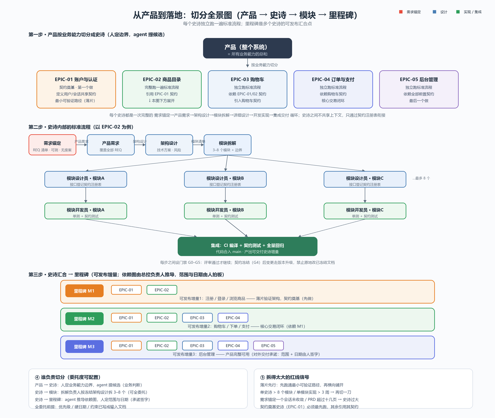

# Codex 大型项目标准开发流程（standard-devflow）

一套开箱即用的 Codex 大型项目标准开发流程：**需求蒸馏 → 产品需求（PRD）→ 架构设计（HLD）→ 模块拆解 → 详细设计（LLD）→ 契约冻结 → 开发实现 → 集成交付**，内置门禁 G0–G5、Git 分支规范、史诗/里程碑切分与跨会话状态持久化。

## 核心设计

1. **需求先蒸馏**：冗长的需求讨论在「需求锚定」阶段收敛为结构化锚点，下游只见锚点、不见噪声。
2. **主管层串行、执行层并行**：产品需求、架构设计、模块拆解、详细设计、开发实现严格先后；只有模块设计员 / 模块开发员内部可并行。
3. **文件即真相**：会话记忆会丢，文件不会。每个产出落盘，交接只传「文件路径 + 一页摘要」。
4. **产出的节点不能当自己的裁判**：每道门禁由上级、独立评审或人类把关。
5. **冻结与变更分离**：契约冻结后禁止原地修改，变更走版本升级。
6. **零复制安装**：做成 Codex skill，一次安装、所有项目可用。
7. **子 Agent 强制编排**：详细设计/开发实现/G2/G5 必须 spawn 子 agent（模块设计员、模块开发员、架构评审员、QA 评审员）；任务正文先落盘为任务文件、spawn 只传路径，子 agent 读取后复述确认，失败不超过 2 次即上报，主会话只做编排与门禁，禁止默默串行。

## 流程一览



## 命名对照

| 旧代号 | 新名称 |
|---|---|
| A0 | 需求锚定 |
| B-1 | 产品需求 |
| B-2 | 架构设计 |
| B-3 | 模块拆解 |
| B-4 | 详细设计 |
| G4 | 契约冻结（门禁） |
| B-5 | 开发实现 |
| 最终集成 | 集成交付 |

## 安装

### 方式 A：手动复制（Windows）

```powershell
Copy-Item -LiteralPath '.\standard-devflow' -Destination "$env:CODEX_HOME\skills\standard-devflow" -Recurse -Force
```

> 注意：目标目录已存在时，PowerShell 的 `Copy-Item` 会把源目录**嵌套**复制进目标目录（`standard-devflow\standard-devflow\`）。如果出现嵌套，请删除内层重复目录，或用以下方式逐项覆盖：

```powershell
$src = '.\standard-devflow'
$dst = "$env:CODEX_HOME\skills\standard-devflow"
Get-ChildItem -LiteralPath $src | ForEach-Object { Copy-Item -LiteralPath $_.FullName -Destination $dst -Recurse -Force }
```

### 方式 B：使用 skill-installer

```powershell
python "$env:CODEX_HOME\skills\.system\skill-installer\scripts\install-skill-from-github.py" https://github.com/qi-mouren/codex-standard-devflow --path skills/standard-devflow
```

### 校验

```powershell
$env:PYTHONUTF8 = '1'
python "$env:CODEX_HOME\skills\.system\skill-creator\scripts\quick_validate.py" "$env:CODEX_HOME\skills\standard-devflow"
```

### 全局规则

把 [docs/global-agents.md.example](docs/global-agents.md.example) 的内容放入 `$env:CODEX_HOME\AGENTS.md`，所有会话自动加载。

## 使用

1. 新项目只需 3 行 `AGENTS.md`：产品名、当前史诗、STATE 指针（`docs/process/STATE.md`）。
2. 会话中说「用 standard-devflow 跑这个史诗」，skill 自动加载。
3. 每次开工先读 `docs/process/STATE.md`，运行 `scripts/check-flow.ps1` 确认流程健康。

## 仓库结构

```
standard-devflow/
├── SKILL.md                  # skill 入口：触发条件 + 流程总览 + 红线
├── agents/openai.yaml        # UI 元数据
├── references/
│   ├── workflow.md           # 完整流程、数据流、回路规则
│   ├── roles.md              # 全部角色提示词
│   ├── gates.md              # 门禁 G0-G5 检查表与 owner
│   ├── splitting.md          # 史诗/模块/里程碑切分
│   └── git-flow.md           # Git 分支/tag/MR 规范
├── assets/templates/         # 8 个产物模板
└── scripts/check-flow.ps1    # 流程健康检查
docs/global-agents.md.example # 全局 AGENTS.md 示例
产品到落地-切分全景图.png      # 流程示意图
```

## 许可

[MIT](LICENSE)